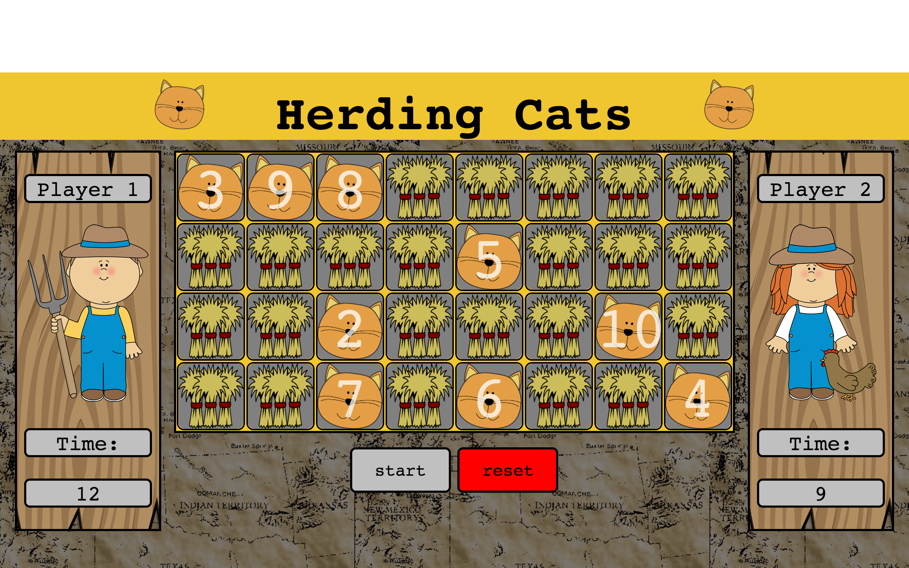

# Herding Cats

---

## A multiplayer counting game

Two players compete against each other to click the cards in the correct order (1-10) and see who can get the fastest time. Players have to be careful not to click out of order or on the wrong tile or else the remaining cards will reshuffle.

#### How to Play:
Use the mouse to select the correct card on the randomized grid. Go as fast as possible without making mistakes.

Play Herding Cats <a href="https://matthewnelson18.github.io/Herding-Cats/" title="HerdingCats"> here</a>.

---

### Development & Technologies
Herding Cats was built using HTML, CSS, Javascript, and the JQuery library.

---
### User Stories
+ As a player, I want to clearly see what cat I have to click next.
+ As a player, I want to clearly see my time.
+ As a player, I want to be able to reset the game without refreshing.
+ As a player I want to have clear instructions.
+ As a developer, I want modular code that will be easy to utilize in multiple situations.

---
### MVP
+ Randomized clickable cards on a grid that show face up and face down.
+ A timer to track player performance.
+ Cards are clickable with the mouse.
+ One player achieving a better time than the other will result in a win.

---
### Dream Features
+ Scalable amount of both face up and face down cards
+ Customizable player names
+ Punish players for taking too long to click between cards
+ Multiple rounds with different difficulty
+ Logging scores between rounds and resets
+ Ability to share game
+ Scalable for number of players
+ Add sounds
+ Timer handles minutes and seconds
